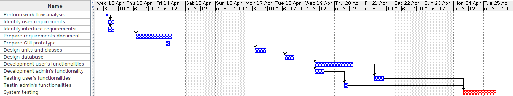

# Project Estimation - CURRENT
Date:

Version:

# Estimation approach
Consider the EZWallet  project in CURRENT version (as received by the teachers), assume that you are going to develop the project INDEPENDENT of the deadlines of the course
# Estimate by size
### 
|             | Estimate                        |             
| ----------- | ------------------------------- |  
| NC =  Estimated number of classes to be developed   | 4 |             
|  A = Estimated average size per class, in LOC       | 80 | 
| S = Estimated size of project, in LOC (= NC * A) | 320 |
| E = Estimated effort, in person hours (here use productivity 10 LOC per person hour)  |   8 |   
| C = Estimated cost, in euro (here use 1 person hour cost = 30 euro) | 960 | 
| Estimated calendar time, in calendar weeks (Assume team of 4 people, 8 hours per day, 5 days per week ) | 0.2 |               

# Estimate by product decomposition
### 
|         component name    | Estimated effort (person hours)   |             
| ----------- | ------------------------------- | 
|requirement document    | 6 |
| GUI prototype | 1 |
|design document | 8 |
|code | 8 |
| unit tests | 6 |
| api tests | 6 |
| management documents  | 5 |

# Estimate by activity decomposition
### 
|         Activity name    | Estimated effort (person hours)   |             
| ----------- | ------------------------------- | 
| Perform work flow  analysis | 0.5 |
| Identify user requirements | 1 |
| Identify interface requirements| 1 |
| Prepare requirements document | 3.5 |
| Prepare GUI prototype | 1 |
| Design units and classes | 2 |
| Design database | 2 |
| Development user's functionalities | 4 |
| Development admin's functionalities | 2 |
| Testing user's functionalities | 2 |
| Testing admin's functionalities | 1 |
| System test | 1 |
###
Insert here Gantt chart with above activities

# Summary

Report here the results of the three estimation approaches. The  estimates may differ. Discuss here the possible reasons for the difference

|             | Estimated effort                        |   Estimated duration |          
| ----------- | ------------------------------- | ---------------|
| estimate by size |8 person hours|0.2 calendar weeks|
| estimate by product decomposition |10 person hours|0.25 calendar weeks|
| estimate by activity decomposition |16 person hours|0.4 calendar weeks|

