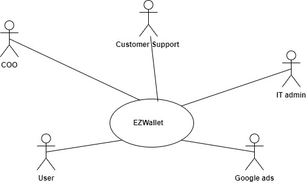

# Requirements Document - current EZWallet

Date: 

Version: V1 - description of EZWallet in CURRENT form (as received by teachers)

 
| Version number | Change |
| ----------------- |:-----------|
| | | 

# Contents

- [Informal description](#informal-description)
- [Stakeholders](#stakeholders)
- [Context Diagram and interfaces](#context-diagram-and-interfaces)
	+ [Context Diagram](#context-diagram)
	+ [Interfaces](#interfaces) 
	
- [Stories and personas](#stories-and-personas)
- [Functional and non functional requirements](#functional-and-non-functional-requirements)
	+ [Functional Requirements](#functional-requirements)
	+ [Non functional requirements](#non-functional-requirements)
- [Use case diagram and use cases](#use-case-diagram-and-use-cases)
	+ [Use case diagram](#use-case-diagram)
	+ [Use cases](#use-cases)
    	+ [Relevant scenarios](#relevant-scenarios)
- [Glossary](#glossary)
- [System design](#system-design)
- [Deployment diagram](#deployment-diagram)

# Informal description
EZWallet (read EaSy Wallet) is a software application designed to help individuals and families keep track of their expenses. Users can enter and categorize their expenses, allowing them to quickly see where their money is going. EZWallet is a powerful tool for those looking to take control of their finances and make informed decisions about their spending.

# Stakeholders

| Stakeholder name  | Description 											 | 
| ----------------- |:------------------------------------------------------:|
| users				| individuals that want to keep track of their expenses  | 
| Customer support  | manages user accounts              					 |
| IT admins   		| manages application and database              		 | 
| COO 				| business developer             						 | 
| Competitors   	| other companies that offer the same service            | 
| Google Ads   	    | 3rd party Ads provider for the frontend             	 | 
| Host   			| 3rd party hosting service              				 | 
<!-- | GDPR					| legal requirements (data and privacy)| -->

# Context Diagram and interfaces

## Context Diagram

## Interfaces

| Actor | Logical Interface | Physical Interface  |
| ------------- |:-------------:| -----:|
|   User     | GUI (to be defined – key functions, add and delete transactions/categories) | Smartphone or PC (web browser) |
|   Customer support     | GUI (to be defined – key functions, same as normal users + the ability to manage user accounts) | Smartphone or PC (web browser) |
| IT Admin | CLI of the hosting service | PC |
|   COO     | Gui (to be defined, all functions + analytics) | Smartphone or PC (web browser) |
|   Google Ads     | API  | Internet link |

# Stories and personas
\<A Persona is a realistic impersonation of an actor. Define here a few personas and describe in plain text how a persona interacts with the system>

\<Persona is-an-instance-of actor>

\<stories will be formalized later as scenarios in use cases>

# Functional and non functional requirements

## Functional Requirements

| ID        | Description  |
| :------------- |:-------------| 
| FR1     |  Authorize and authenticate |
| FR1.1     |  Login as old user |
| FR1.2     |  Log out |
| FR1.3| Register as a new user|
| FR1.4 | get user details |
| FR2 | Manage transactions |
| FR2.1 | Create transaction and specify its category |
| FR2.2 | Delete transaction |
| FR2.3 | View transactions and their categories |
| FR3 | Create category |
| FR5 | Manage users |
| FR5.1 | Get users by username |
| FR6 | Receive and show Ads |

## Non Functional Requirements

| ID        | Type (efficiency, reliability, ..)           | Description  | Refers to |
| ------------- |:-------------:| :-----:| -----:|
|  NFR1     |  Usability | Users should use the core functions after following a simple tutorial on first login | |
|  NFR2     | Compatibility | The website (frontend) should run on all browsers | |
|  NFR3     | Security | Protection from malicious access, user authorization, comply with data safety and privacy laws such as GDPR | |
|  NFR4 | Efficiency | website load time should be less than 3s from PC and 5s for mobile, server response time should be less than 0.5s | | 
|  NFR5 | Maintainability | fix defects in less than 1hr, add/modify/or cancel a software function within 24hrs | | 
|  NFR6 | Availability | The server should not go down for more than 30 mins at a time | | 

# Use case diagram and use cases

## Use case diagram
\<define here UML Use case diagram UCD summarizing all use cases, and their relationships>

\<next describe here each use case in the UCD>
### Use case 1, UC1
| Actors Involved        |  |
| ------------- |:-------------:| 
|  Precondition     | \<Boolean expression, must evaluate to true before the UC can start> |
|  Post condition     | \<Boolean expression, must evaluate to true after UC is finished> |
|  Nominal Scenario     | \<Textual description of actions executed by the UC> |
|  Variants     | \<other normal executions> |
|  Exceptions     | \<exceptions, errors > |

##### Scenario 1.1 

\<describe here scenarios instances of UC1>

\<a scenario is a sequence of steps that corresponds to a particular execution of one use case>

\<a scenario is a more formal description of a story>

\<only relevant scenarios should be described>

| Scenario 1.1 | |
| ------------- |:-------------:| 
|  Precondition     | \<Boolean expression, must evaluate to true before the scenario can start> |
|  Post condition     | \<Boolean expression, must evaluate to true after scenario is finished> |
| Step#        | Description  |
|  1     |  |  
|  2     |  |
|  ...     |  |

##### Scenario 1.2

##### Scenario 1.x

### Use case 2, UC2
..

### Use case x, UCx
..

# Glossary

\<use UML class diagram to define important terms, or concepts in the domain of the application, and their relationships> 

\<concepts must be used consistently all over the document, ex in use cases, requirements etc>

# System Design
\<describe here system design>

\<must be consistent with Context diagram>

# Deployment Diagram 

\<describe here deployment diagram >

