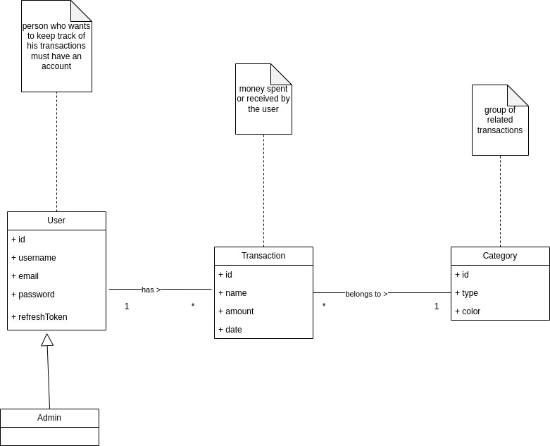

# Requirements Document - current EZWallet

Date: 

Version: V1 - description of EZWallet in CURRENT form (as received by teachers)

 
| Version number | Change |
| ----------------- |:-----------|
| | | 

# Contents

- [Informal description](#informal-description)
- [Stakeholders](#stakeholders)
- [Context Diagram and interfaces](#context-diagram-and-interfaces)
	+ [Context Diagram](#context-diagram)
	+ [Interfaces](#interfaces) 
	
- [Stories and personas](#stories-and-personas)
- [Functional and non functional requirements](#functional-and-non-functional-requirements)
	+ [Functional Requirements](#functional-requirements)
	+ [Non functional requirements](#non-functional-requirements)
- [Use case diagram and use cases](#use-case-diagram-and-use-cases)
	+ [Use case diagram](#use-case-diagram)
	+ [Use cases](#use-cases)
    	+ [Relevant scenarios](#relevant-scenarios)
- [Glossary](#glossary)
- [System design](#system-design)
- [Deployment diagram](#deployment-diagram)

# Informal description
EZWallet (read EaSy Wallet) is a software application designed to help individuals and families keep track of their expenses. Users can enter and categorize their expenses, allowing them to quickly see where their money is going. EZWallet is a powerful tool for those looking to take control of their finances and make informed decisions about their spending.

# Stakeholders

| Stakeholder name  | Description 											 | 
| ----------------- |:------------------------------------------------------:|
| Users				| individuals that want to keep track of their expenses  | 
| Admins   			| monitors user accounts				             		 | 

# Context Diagram and interfaces

## Context Diagram

## Interfaces

| Actor | Logical Interface | Physical Interface  |
| ------------- |:-------------:| -----:|
|   User     | GUI (to be defined – key functions, add, view and delete transactions/categories) | Smartphone or PC (web browser) |
|   Admin    | GUI (to be defined – key functions, same as normal users + the ability to monitor user accounts) | Smartphone or PC (web browser) |

# Stories and personas
\<A Persona is a realistic impersonation of an actor. Define here a few personas and describe in plain text how a persona interacts with the system>

\<Persona is-an-instance-of actor>

\<stories will be formalized later as scenarios in use cases>

# Functional and non functional requirements

## Functional Requirements

| ID        | Description  |
| :------------- |:-------------| 
| FR1     |  Authorize and authenticate |
| FR1.1     |  Login as old user |
| FR1.2     |  Log out |
| FR1.3| Register as a new user|
| FR1.4 | get user details |
| FR2 | Manage transactions |
| FR2.1 | Create transaction and specify its category |
| FR2.2 | Delete transaction |
| FR2.3 | View transactions and their categories |
| FR3 | Create category |
| FR4 | Manage users |
| FR4.1 | Get users by username |

## Non Functional Requirements

| ID        | Type (efficiency, reliability, ..)           | Description  | Refers to |
| ------------- |:-------------:| :-----:| -----:|
|  NFR1     |  Usability | Users should use the core functions after following a simple tutorial on first login | |
|  NFR2     | Compatibility | The website (frontend) should run on all browsers | |
|  NFR3     | Security | Protection from malicious access, user authorization, comply with data safety and privacy laws such as GDPR | |
|  NFR4 | Efficiency | website load time should be less than 3s from PC and 5s for mobile, server response time should be less than 0.5s | | 
|  NFR5 | Maintainability | fix defects in less than 1hr, add/modify/or cancel a software function within 24hrs | | 
|  NFR6 | Availability | The server should not go down for more than 30 mins at a time | | 

# Use case diagram and use cases

## Use case diagram
\<define here UML Use case diagram UCD summarizing all use cases, and their relationships>

\<next describe here each use case in the UCD>
### Use case 1, REGISTRATION
| Actors Involved        | User |
| ------------- |:-------------:| 
|  Precondition     | The User has no account |
|  Post condition     | The User has a new account |
|  Nominal Scenario     | System stores the account |
|  Variants     | The User does not fill in all required fields |
|  Exceptions     | The email is not available |
<!-- |  Exceptions     | The email is not available or a server error occurs | -->

##### Scenario 1.1 
| Scenario 1.1 | Nominal |
| ------------- |:-------------:| 
|  Precondition     | The User has no account |
|  Post condition     | The User has a new account |
| Step#        | Description  |
|  1     | The User asks to sign up |  
|  2     | The system shows the page where to enter the data |
|  3     | The User inserts the username, the email, and the password |
|  4     | The User submits form |
|  5     | System checks if the User account already exists |
|  6     | System stores the account |

##### Scenario 1.2 
| Scenario 1.2 | Exception |
| ------------- |:-------------:| 
|  Precondition     | The User has an account |
|  Post condition     | The operation ends with an error message |
| Step#        | Description  |
|  1     | The User asks to sign up |  
|  2     | The system shows the page where to enter the data |
|  3     | The User inserts the username, the email, and the password |
|  4     | The User submits form |
|  5     | System checks if the User account already exists |
|  6     | The email is already in use |
|  7     | System notifies the User that he/she is already registered |

<!-- ##### Scenario 1.3 
| Scenario 1.3 | Exception |
| ------------- |:-------------:| 
|  Precondition     | -- |
|  Post condition     | The operation ends with an error message |
| Step#        | Description  |
|  1     | The User asks to sign up |  
|  2     | The system shows the page where to enter the data |
|  3     | The User inserts the username, the email, and the password |
|  4     | The User submits form |
|  5     | An error occurs inside the server |
|  6     | The system notifies the User that an error occurred | -->

### Use case 2, LOGIN
| Actors Involved        | User |
| ------------- |:-------------:| 
|  Precondition     | The User has an account |
|  Post condition     | The User is authorized |
|  Nominal Scenario     | The email and password are correct |
|  Variants     | The User does not fill in both required fields |
|  Exceptions     | The email and password do not match or email does not exist |
<!-- |  Exceptions     | The email and password do not match or email does not exist or a server error occurs | -->

##### Scenario 2.1 
| Scenario 2.1 | Nominal|
| ------------- |:-------------:| 
|  Precondition     | The User has an account |
|  Post condition     | The User is authorized |
| Step#        | Description  |
|  1     | User asks to login |  
|  2     | System asks for email and password |
|  3     | User enters email and password |
|  4     | System checks if email and password are correct; so the User is authorized |

##### Scenario 2.2
| Scenario 2.2 | Exception |
| ------------- |:-------------:| 
|  Precondition     | The User has an account |
|  Post condition     | The User is not authorized |
| Step#        | Description  |
|  1     | The User asks to login |  
|  2     | System asks email and password |
|  3     | The User enters email and password |
|  4     | System checks if email and password are correct, but the email and password do not match, so the User is not authorized |

##### Scenario 2.3
| Scenario 2.3 | Exception |
| ------------- |:-------------:| 
|  Precondition     | The User has an account |
|  Post condition     | The User is not authorized |
| Step#        | Description  |
|  1     | The User asks to login |  
|  2     | System asks email and password |
|  3     | The User enters email and password |
|  4     | System checks if email and password are correct, but the email does not exist, so the User is not authorized |

<!-- ##### Scenario 2.4
| Scenario 2.4 | Exception |
| ------------- |:-------------:| 
|  Precondition     | -- |
|  Post condition     | The User is not authorized |
| Step#        | Description  |
|  1     | The User asks to login |  
|  2     | System asks email and password |
|  3     | The User enters email and password |
|  4     | System checks if email and password are correct, but the email does not exist, so the User is not authorized | -->

### Use case 3, LOGOUT
| Actors Involved        | User |
| ------------- |:-------------:| 
|  Precondition     | The User is logged in |
|  Post condition     | The User is logged out |
|  Nominal Scenario     | The operation is successful |
|  Variants     | --- |
|  Exceptions     | The user does not have an account or a server error arrests the operation |
<!-- |  Exceptions     | The user does not have an account or a server error arrests the operation | -->

##### Scenario 3.1 
| Scenario 3.1 | Nominal |
| ------------- |:-------------:| 
|  Precondition     | The User is logged in |
|  Post condition     | The User is logged out |
| Step#        | Description  |
|  1     | User asks to logout |  
|  2     | System allows the operation |

##### Scenario 3.2
| Scenario 3.2| Exception |
| ------------- |:-------------:| 
|  Precondition     | The User is logged in |
|  Post condition     | The User is not logged out |
| Step#        | Description  |
|  1     | User asks to logout |  
|  2     | System deny the operation because of a server error |

<!-- ##### Scenario 3.3
| Scenario 3.2| Exception |
| ------------- |:-------------:| 
|  Precondition     | The User is logged in |
|  Post condition     | The User is not logged out |
| Step#        | Description  |
|  1     | User asks to logout |  
|  2     | System deny the operation because of a server error | -->

### Use case 4, READ USERS Veronica

### Use case 5, CREATE TRANSACTION Inaam

### Use case 6, READ TRANSACTIONS DETAILS Kamel

### Use case 7, DELETE TRANSACTION Inaam

### Use case 8, CREATE CATEGORY Francesco

# Glossary

# System Design
\<describe here system design>

\<must be consistent with Context diagram>

# Deployment Diagram 

\<describe here deployment diagram >

